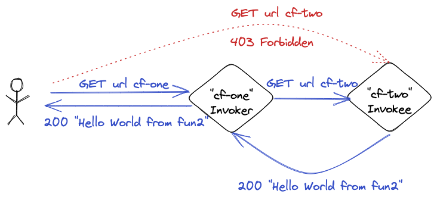

## Authenticating function to function calls 

Demo to show how to configure an invoker Cloud Function 2nd Gen to call a second invokee Cloud Function 2nd Gen. Official Google documentation [here](https://cloud.google.com/functions/docs/securing/authenticating#functions-bearer-token-example-python). Chosen runtime Python 3.10.

`main.tf` includes:

1. `GCS bucket` to store Cloud Function's code

2. `Invokee Cloud Function "cf-two":` it provides an HTTP endpoint that returns "Hello World from fun 2". The Python code can be found at functions/fun_two. It is zipped using Terraform [archive_file(Data_Source)](https://registry.terraform.io/providers/hashicorp/archive/latest/docs/data-sources/file) and loaded to the GCS bucket. The Cloud Function is then created from the uploaded code. 

3. `Invoker function "cf-one" Service Account` including Cloud Role Invoker role and Computer Engine Admin. Careful!!! The Compute Engine Admin role is used for demo purposes only. Make sure your Service Accounts include the bare minimun permissions needed.

4. `Invoker Function "cf-one":` any user can trigger an HTTP request which is redirected to the Invokee Function URL following Google's documentation on Authenticating function to function calls. Python code can be found at functions/fun_one and it is again zipped, loaded to a GCS bucket and used to deploy the Cloud Function. This function needs to be aware of the endpoint of the invokee function. This information is provided usin g the templatefile function while processing the main.py into zip. The Cloud Function service configuration block specifies the above Service Account as the SA the function will use, including the Cloud Run Invoker role.

5. `Invkoker Function "cf-one" IAM binding` to allow allUsers to trigger an unauthenticated call.

This demo can be run as follows:

1. Run `terraform init`

2. Run `terraform apply`

3. Access `cf-one` url and verify web returns content served from cf-two -> `"Hello World from fun 2!"`
